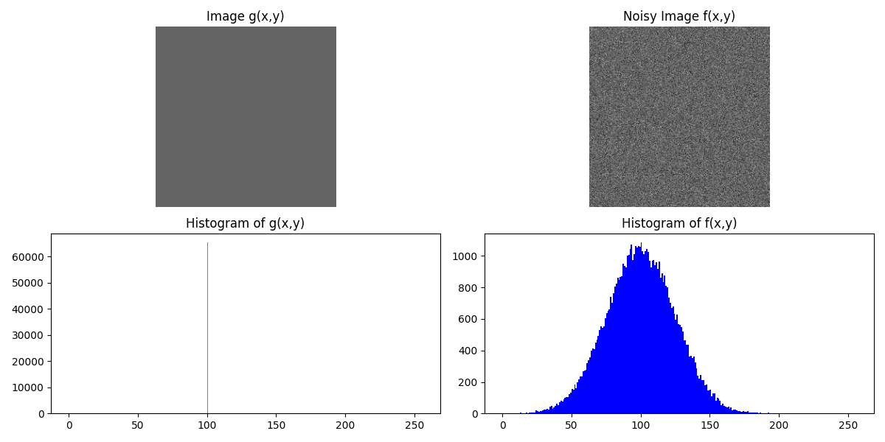

# HW6 – Adding Gaussian Noise

This assignment involves generating an image and adding Gaussian noise to it. The task is divided into several steps:

## Task Description

1. **Create an image g(x,y)** where all the pixels have the same gray value of 100. Display the image g(x,y).
2. **Generate Gaussian noise n(x,y)** using the algorithm shown in the next page.
3. **Create a noisy image** \( f(x,y) = g(x,y) + n(x,y) \) and display it.
4. **Display the histogram h(i)** of the noisy image f(x,y).

## Result

The output of the assignment is displayed in the image below:



## Observations

The original image is a grayscale image where all pixel values are set to 100, resulting in a very uniform image. The histogram of this image will show a peak at 100, with pixel values concentrated around this value.

After adding Gaussian noise, the pixel values of the image begin to show a distribution close to a normal distribution, which causes a diffusion of the pixel values. This shows how noise effectively disrupts the pixel values of the image, leading to fluctuations in the details of the image. The histogram also demonstrates the spread and variation of pixel values across a broader gray scale range after noise is added.

## How to Run

First, install the necessary dependencies:

```bash
pip3 install numpy opencv-python
```
Then, run the program：

```bash
python3 hw6.py
```
