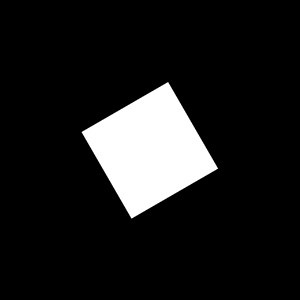

# Rotation with Nearest Neighbor and Bilinear Interpolation

本作業實作影像旋轉功能，並比較最近鄰插值（Nearest Neighbor）與雙線性插值（Bilinear Interpolation）在旋轉後的效果差異。

## 結果展示

| 原始影像 | 最近鄰旋轉 | 雙線性旋轉 |
|----------|------------|------------|
|  |  |  |

## 結果觀察

最近鄰插值旋轉後只選取最接近的像素值，因此影像邊緣會出現鋸齒狀，整體畫面保留明確的黑白分界。  
雙線性插值則會根據周圍四個像素進行加權平均，因此邊緣會稍微模糊，但視覺上較平滑，鋸齒較少。

## 執行方式

請先安裝必要套件：

```bash
pip install numpy opencv-python
```
執行程式：

```bash
python3 hw4.py
```
