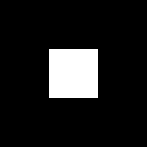

# Rotation with Nearest Neighbor and Bilinear Interpolation

This assignment implements image rotation and compares the effects of Nearest Neighbor and Bilinear Interpolation after rotation.

## Result Demonstration

| Original Image | Nearest Neighbor Rotation | Bilinear Rotation |
|----------------|---------------------------|-------------------|
|  |  |  |

## Observations

The Nearest Neighbor interpolation only selects the closest pixel value, which causes jagged edges in the image, and the overall image retains a clear black-and-white boundary.  
Bilinear interpolation, on the other hand, performs a weighted average based on the surrounding four pixels, resulting in slightly blurred edges, but with a smoother appearance and fewer jagged edges.

## How to Run

First, install the necessary dependencies:

```bash
pip3 install numpy opencv-python
```
Then, run the program：

```bash
python3 hw4.py
```
